# PDF Summarizer Pipeline

A systematic tool to extract, clean, chunk, and summarize PDF documents using multiple AI providers (Gemini, OpenAI, DeepSeek, Ollama).

## 📋 Requirements

- **Python**: Version 3.8 or higher
- **Dependencies**: Install via `pip install -r requirements.txt`

## 🔑 API Keys Configuration

1. Copy `.env.example` to `.env`:
   ```bash
   cp .env.example .env
   ```
2. Add your keys in `.env`:
   ```ini
   OPENAI_API_KEY=sk-...
   DEEPSEEK_API_KEY=sk-...
   GEMINI_API_KEY=...
   OLLAMA_API_KEY=...
   ```
   _(Note: Ollama normally runs locally, but if you have authentication enabled or are using a remote instance, set the key here)_

## 🚀 How to Run

### Option 1: Automated Pipeline (Partial)

Runs extraction, cleaning, and chunking automatically.

```bash
cd src
python main.py
```

_Outputs:_ `output/cleaned.txt`, prints chunks to console.

### Option 2: Individual Modules (Step-by-Step)

1. **Extraction & Cleaning**:

   ```bash
   python src/extractor.py  # Or rely on main.py
   ```

2. **Chunking**:

   ```bash
   python src/chunking/chunker.py
   ```

   _Generates:_ `output/chunks.txt`

3. **Summarization** (Runs on generated chunks):

   ```bash
   python src/summarization/summarizer.py
   ```

   _Generates:_ `output/chunk_summaries.txt`

4. **Embedding** (Generate vectors for chunks):
   ```bash
   python src/embedding/embedding.py
   ```

## 🔄 System Flow Diagram

```mermaid
graph TD
    A[📄 Input PDF] -->|extractor.py| B(📝 Raw Text)
    B -->|cleaner.py| C{Clean Data?}
    C -->|Remove Gibberish/Headers| D[🧹 Cleaned Text]
    D -->|chunker.py| E[🧩 Text Chunks]

    E -->|summarizer.py| F[🤖 AI Summarizer]
    F --> G[gemini]
    F --> H[openai]
    F --> I[ollama]
    F --> J[deepseek]

    E -->|embedding.py| K[📐 Vector Embeddings]

    G & H & I & J --> L[📑 Final Summaries]
```



## 📂 Project Structure

- `src/main.py`: Orchestrator for extraction -> chunking.
- `src/extractor.py`: Handles PDF parsing (PyMuPDF/pypdf).
- `src/cleaner.py`: Removes noise, headers, and footers.
- `src/chunking/`: splits text into overlapping windows.
- `src/summarization/`: AI providers and prompt logic.
- `src/embedding/`: Vector generation using Gemini.
