# PDF Summarizer & RAG Q&A System

A comprehensive tool to extract, clean, chunk, summarize, and perform Question-Answering (RAG) on PDF documents. It uses **Google Gemini** for generation and embeddings, and **FAISS** for vector storage.

## ✨ Features

- **Document Processing**: Extracts text from PDFs, cleans noise (headers/footers), and chunks text intelligently.
- **AI Summarization**: Generates concise summaries of document sections using Gemini 2.5 Flash.
- **RAG Q&A**: Ask questions about your document and get answers based on accurate context retrieval.
- **Dual Interfaces**:
  - **API**: FastAPI backend for integration.
  - **Web UI**: Modern Streamlit interface.

## 📋 Requirements

- **Python**: Version 3.8 or higher.
- **Dependencies**:
  ```bash
  pip install -r requirements.txt
  ```

## 🔑 Configuration

1. **Environment Variables**:
   Create a `.env` file in the root directory:

   ```ini
   GEMINI_API_KEY=your_api_key_here
   ```

2. **Streamlit Secrets** (For hosting UI):
   If deploying to Streamlit Cloud, add `GEMINI_API_KEY` to your app's secrets.

## 🚀 How to Run

### 1. Web UI (Recommended)

This is the dynamic interface where you can upload ANY PDF.

```bash
cd src
python -m streamlit run streamlit_app.py
```

- **Upload**: Drag & drop any PDF in the sidebar.
- **Chat**: Ask questions about the uploaded document immediately.

### 2. Output Data Pipeline (Manual)

If you want to process the default file (`file/data.pdf`) without the UI:

```bash
cd src
python main.py
```

_Outputs:_ `output/cleaned.txt`, `output/index.faiss`, `output/metadata.pkl`

### 3. API Server (FastAPI)

For backend integration (uses the processed data from step 2 or UI).

```bash
cd src
uvicorn api:app --reload --port 8000
```

**Test Endpoint:**

```bash
curl -X POST "http://127.0.0.1:8000/ask" \
     -H "Content-Type: application/json" \
     -d '{"question": "What is the main topic?"}'
```

## 🔄 System Architecture

```mermaid
graph TD
    A[📄 Input PDF] -->|extractor.py| B(📝 Raw Text)
    B -->|cleaner.py| C{Clean Data?}
    C -->|Remove Gibberish/Headers| D[🧹 Cleaned Text]
    D -->|chunker.py| E[🧩 Text Chunks]

    subgraph "Vector Search (RAG)"
    E -->|embedding.py| K[📐 Vector Embeddings]
    K --> M[🗄️ FAISS Index]
    M --> N[🔍 Retrieval System]
    end

    subgraph "Interfaces"
    N --> P[🖥️ Streamlit UI]
    N --> Q[🔌 FastAPI]
    end

    Q & P --> R[🤖 Gemini Answer]
```



## 📂 Project Structure

- `src/streamlit_app.py`: **Dynamic Web UI** (Upload & Chat).
- `src/main.py`: Pipeline orchestrator (Extract -> Chunk -> Index).
- `src/rag_core.py`: Shared logic for RAG initialization and retrieval.
- `src/api.py`: FastAPI application.
- `src/embedding/`: Handles Gemini Embeddings and FAISS indexing.
- `src/summarization/`: Summarization logic modules.
- `Dockerfile`: Configuration for Docker deployment.
- `output/`: Stores generated artifacts (index, metadata, cleaned text).
